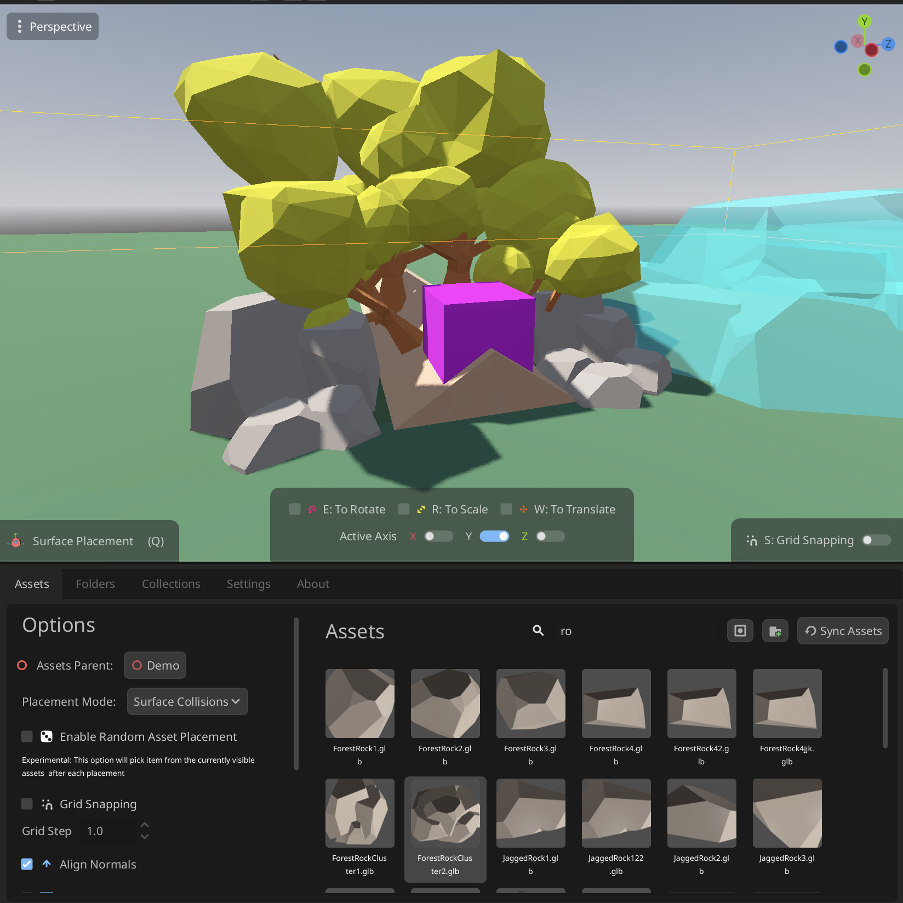
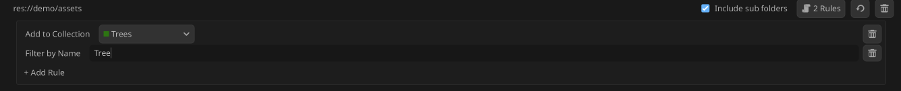
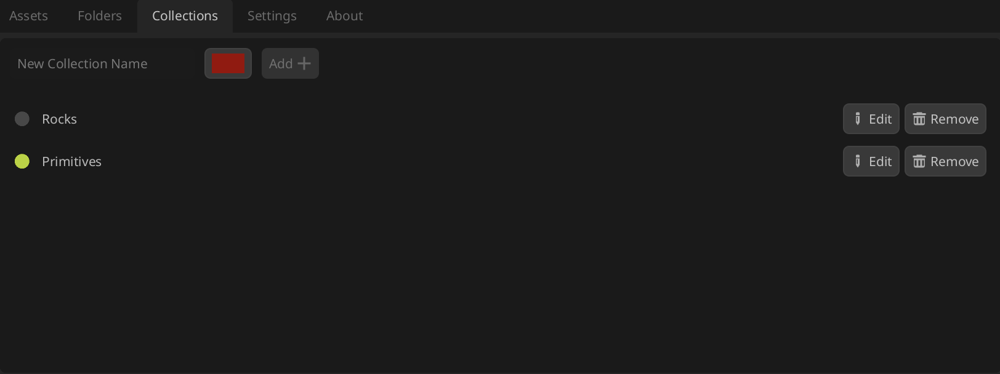
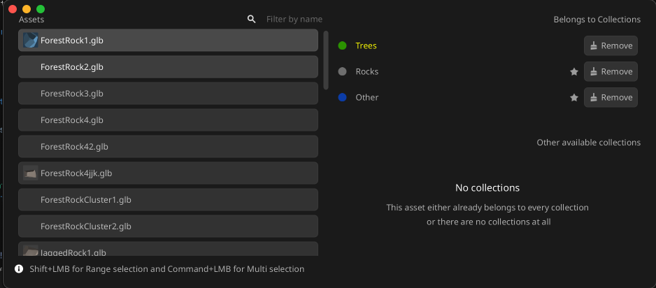
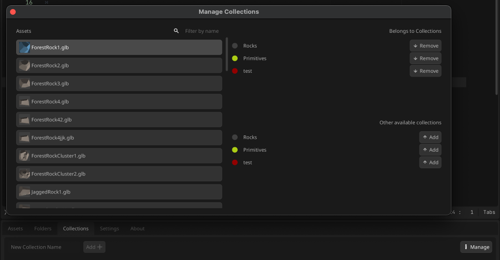
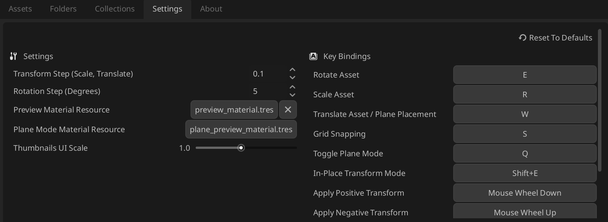

[](https://discord.gg/UyYCp53Hym)


# Godot Asset Placer
This is Godot Editor plugin that allows for quick asset placement and management when working with large 3D Scenes.

<p align="center">
	
</p>

> This plugin is still in development and may have bugs or incomplete features. Please report any issues you encounter
Any Features and Suggestions are welcome as well

## Features
- One-Click Asset Placement with Snapping to Ground, Collision shapes and Terrain3D Surfaces
- [Quick Preview Node Transformations Before Placement](https://github.com/levinzonr/godot-asset-placer/blob/main/README.md#transforming-assets-before-placement)
- **In Place Transform Mode** - Apply transformations to existing nodes in the scene using Asset Placer workflow
- **Settings Panel** - Comprehensive customization options including key bindings, preview materials, and transform steps
- **Random Asset Placement** - Automatically select random assets from filtered list after each placement
- **Advanced Placement Options** - Normal alignment and scene bottom alignment controls
- Organize Assets into collections for quick access and filtering
- **Auto-Grouping** - Automatically group placed assets under nodes named after their primary collection
- **Folder Rules** - Configure rules to automatically assign collections when syncing asset folders
- Filter Assets by their name and collection
- Grid snapping when placing assets
- Randomize asset Rotation and Scale on placement
- Undo-Redo Integration
- In Editor Update when new release is published on GitHub

<p align="center">
  <a href="https://youtu.be/Go2pvRrgrRc" target="_blank">
	
  </a>
</p>
<p align="center">
  <a href="https://youtu.be/WAWQmslarm4" target="_blank">
	
  </a>
</p>




## Installation
1. There are several ways to install the addon: 
- [Godot Asset Library](https://godotengine.org/asset-library/asset/4244) or by searching for "Godot Asset Placer"
- [GitHub Releases page](https://github.com/levinzonr/godot-asset-placer/releases) and download the latest release
- Manually by cloning the repository
No matter which method you choose, the remaining steps are the same

2. Copy the `addons/asset_placer` folder into your Godot project under the `addons` directory. (Godot Asset Library will do this automatically)
3. Enable the plugin in the Godot Editor by going to `Project` -> `Project Settings` -> `Plugins` and enabling the `Asset Placer` plugin.

## Usage
### Adding Assets
Right now the plugin relies on user selecting the folders where your assets are located so that not every scene is added automatically.
You can folders to sync by either Drag And Droping the folder or  using "Add folder button" within Folders Tab


### Folder Rules
> Available since version 1.3.0

Folder Rules allow you to automate actions when syncing asset folders. Rules are configured per-folder and can be combined to create powerful workflows.



**Available Rules:**
- **Add to Collection** - Automatically assign synced assets to a specific collection
- **Filter by Name** - Only include assets whose filename contains specified text

To configure rules, click the "Rules" button on any folder in the Folders tab to expand the rules panel.

### Placing Assets
Godot Asset Placer provides various placement modes. All methods rely on RayCasting to determine where to place the asset.

Placement Modes can be cycled using `Q` Shortcut

#### Surface Collisions (Default)
This mode requires your scene to have Collision Objects (StaticBody3D, CollisionShape3D, etc.) in order to place assets on surfaces. This mode is useful when your scene already has some kind of physical floor and you want your assets placed directly onto it.

#### Plane Collisions
This mode allows you to place assets on an infinite plane at a specified height. This is useful for quickly placing assets in an empty scene or when you want to place assets at a specific height without relying on existing geometry. This plane has a configurable Normal and Point Of origin.
You can quickly enter this mode by pressing `Q` while in placement mode.

If you want to configure Plane Options (Normal and Origin) you can do so within Options Sub View or with `W` Translate Mode
This will allow to move the plane origin using Mouse Wheel along selected Axis

#### Terrain 3d Placement
This mode allows you to place assets directly onto a Terrain3D surface. When selected you will be prompted to select your Terrain3D node. After that the plugin will user Terrain3D surfaces to resolve placement location.

#### Placement Steps
To place an asset, follow these steps:
1. Navigate to the 3D Scene of your choice
2. Optional: Change Placement Mode. By default, the Plugin uses Surface Collision mode, you can change it within Options Sub View
3. Open Asset Placer Dock window and select the asset you want to place from the Assets tab
4. Optional: Change Parent Node. By default, the Plugin will select as Root Node3D as the parent, you can change it withing Options Sub View
5. Optional: Configure Placement Options:
   - **Align Normals** - Enable to align assets with surface normals for natural placement on sloped surfaces
   - **Use Assets Origin** - Enable to place using asset's local origin point, or disable to use the asset's actual bottom
6. At this point you will see a preview of the asset in the 3D viewport
7. Press `Left Mouse Button` to place the asset at the location of the mouse cursor
8. If you want to modify the asset after placement, you can press `Shift` + `Left Mouse Button` to Place And Focus on the Placed Asset. This allows you to move, rotate, or scale the asset using the standard Godot Editor tools.

#### Random Asset Placement
You can enable random asset placement in the Asset Placement Options. When enabled, after each placement, a new asset will be randomly selected from the currently filtered list of assets in the Assets Panel. This is useful for quickly populating scenes with varied assets.

> ⚠️ This feature is experimental and may require further improvements in the future.

#### Auto-Grouping by Collection
> Available since version 1.3.0

When enabled in the Asset Placement Options, placed assets will automatically be grouped under Node3D nodes named after their **primary collection**. This keeps your scene tree organized without manual effort.

For example, if you have assets assigned to "Trees" and "Rocks" collections:
```
- Parent (your selected parent node)
    - Trees (auto-created group)
        - Tree(1)
        - Tree(2)
    - Rocks (auto-created group)
        - Rock(1)
        - Rock(2)
```

Assets without a primary collection will be placed directly under the parent node. See [Primary Collections](#primary-collections) for how to set the primary collection for your assets.

#### Transforming Assets Before Placement
1.1.0 introduces the ability to modify the preview of the asset before placement. This includes options for rotation and scaling, allowing users to visualize how the asset will appear in the scene prior to placement, do quick and precise adjustment modifications.

Specific transformation mode can be enabled by pressing button while in placement mode (Asset is selected) and transformations can be applied by Mouse Wheel:
- `Mouse Wheel Up`: "Positive" transformation
- `Mouse Wheel Down`: "Negative" transformation

Following transformations are supported:
- `E` to rotate (Default axis is Y)
- `R` to scale (Uniform Scale by default, All axis at once)
- `W` to translate (Default axis is Y) - Activates `Plane Placement Mode`

This also requires an ability to select active Axis for the transformation. This can be done by pressing following keys:
- `X` to select X axis
- `Y` to select Y axis
- `Z` to select Z axis

#### In Place Transform Mode
1.2.0 introduces **In Place Transform Mode**, which allows you to apply transformations to existing nodes in your scene using the same Asset Placer transformation workflow. This is useful when you want to adjust nodes that are already placed in your scene.

To use In Place Transform Mode:
1. Select a Node3D in the scene tree
2. Press `Shift+E` (default shortcut, configurable in Settings) to enter In Place Transform Mode
3. Use the same transformation shortcuts (`E` for rotate, `R` for scale, `W` for translate) to modify the selected node
4. Use `X`, `Y`, `Z` keys to select the transformation axis
5. Apply transformations with Mouse Wheel Up/Down

The viewport overlay will display the current transformation mode and active axis, just like in preview placement mode.

### Organizing Assets
You can organize your assets into Collections. Collections is a simple way to "group" assets together by some criteria. For example, you can create a collection for all the trees in your scene, or all the rocks, etc.
To create a collection navigate to the Collections tab, choose a name and color. Then you can assign assets into one or more collections, either by using a options menu or dragging and dropping assets into the window while Collection Filter is active.



#### Collection Management
> Available since version 1.3.0

The Collection Management dialog provides a streamlined way to assign and remove collections from multiple assets at once.



**Features:**
- **Batch Selection** - Select multiple assets using Shift+Click (range) or Ctrl/Cmd+Click (multi-select)
- **Quick Assignment** - Add or remove collections from all selected assets with one click
- **Visual Feedback** - See which collections are fully assigned, partially assigned, or available

To open the Collection Management dialog:
- Click "Manage Collections" button in the Collections tab
- Right-click an asset and select "Manage Collections"

#### Primary Collections
> Available since version 1.3.0

Each asset can have one **primary collection** that determines how it's grouped when using [Auto-Grouping](#auto-grouping-by-collection).



**Setting a Primary Collection:**
- In the Collection Management dialog, assigned collections show a star icon
- Click the star to set that collection as primary / Click Again to reset it 

When multiple assets are selected, the star button is always visible for easy batch assignment of primary collections.

### Settings Panel
Version 1.2.0 introduced a dedicated Settings Panel for comprehensive customization of the Asset Placer plugin.


#### General Settings
- **Preview Material** - Choose your own Material3D resource or disable preview materials entirely
- **Plane Material** - Customize the appearance of the plane used in Plane Placement Mode (Project-level setting)
- **Transform Step** - Configure the amount of rotation/scale applied per Mouse Wheel step
  - Rotation Step (default: 5 degrees)
  - Scale/Translate Step (default: 0.1 units)
- **Thumbnail UI Scale** - Adjust the size of thumbnails in the Assets Panel (default: 1.0)
- **Plane Mode Toggle** - Configure plane placement mode behavior
- **Asset Library Path** - Set a custom location for the `asset_library.json` file, useful for version control and team sharing

#### Key Bindings
Customize shortcuts for all Asset Placer actions:
- Rotate (Default: `E`)
- Scale (Default: `R`)
- Translate (Default: `W`)
- Cycle Placement Modes (Default: `Q`)
- Toggle Snapping (Default: `S`)
- Toggle X, Y, Z Axis (Default: `X`, `Y`, `Z`)
- Transform Apply (Default: Mouse Wheel Up/Down)
- In Place Transform Mode (Default: `Shift+E`)

Key bindings support Mouse Button and Modifier Combinations (Ctrl, Shift, Alt), allowing you to avoid conflicts with existing Godot shortcuts. The Settings Panel includes conflict detection that will highlight conflicting keys in red.

All settings are persisted across Godot sessions within EditorSettings and apply to all your projects.

## Known Issues
- So far plugin only supports `tscn` files, `glb`, `gltf` `obj` and `fbx` models. If you have any other formats you would like to see supported, please let me know.
- Sometimes Previews for the Assets are not perfect - but they are directly take from the Godot Previews system


## Contributing
Found a problem or have an idea?
- [🐛 Report a bug](https://github.com/levinzonr/godot-asset-placer/issues/new?template=bug_report.md&labels=bug&title=%5BBUG%5D%20)
- [✨ Request a feature](https://github.com/levinzonr/godot-asset-placer/issues/new?template=feature_request.md&labels=enhancement&title=%5BFeature%5D%20)
- [📖 Contributing guidelines](CONTRIBUTING.md)


## Changelog
See the [CHANGELOG.md](CHANGELOG.md) for a full list of changes and updates.
