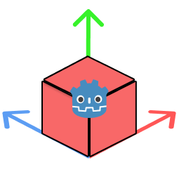
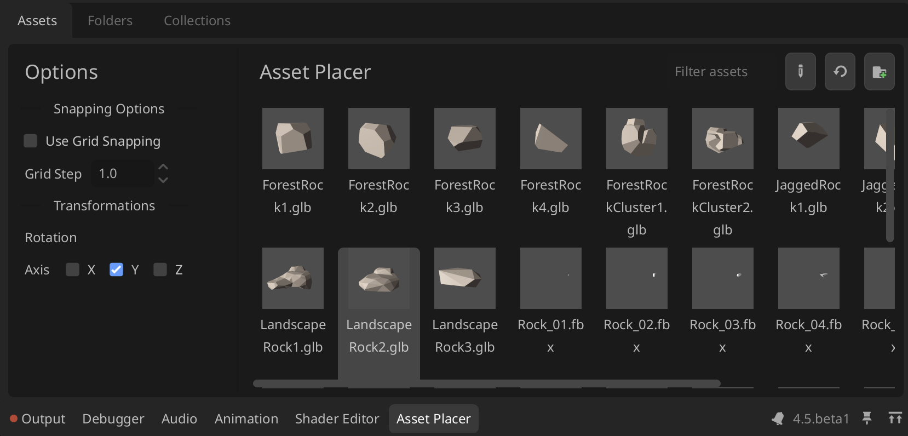
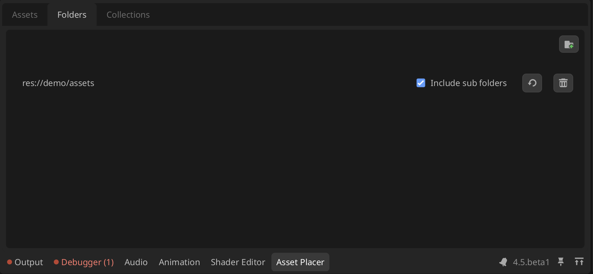
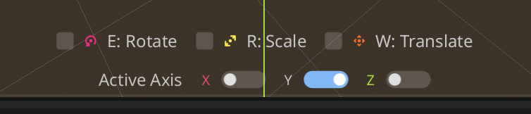

# Godot Asset Placer
This is Godot Editor plugin that allows for quick asset placement and management when working with large 3D Scenes.

	

> This plugin is still in development and may have bugs or incomplete features. Please report any issues you encounter
Any Features and Suggestions are welcome as well

## Features
- One-Click Asset Placement with Snapping to Ground and other Collision shapes
- [Quick Preview Node Transformations Before Placement](https://github.com/levinzonr/godot-asset-placer/blob/main/README.md#transforming-assets-before-placement)
- Organize Assets into collections for quick access and filtering
- Filter Assets by their name and collection
- Grid snapping when placing assets
- Randomize asset Rotation and Scale on placement
- Undo-Redo Integration
- In Editor Update when new release is published on GitHub

  

## Installation
1. There are several ways to install the addon: 
- [Godot Asset Library](https://godotengine.org/asset-library/asset/4244) or by searching for "Godot Asset Placer"
- [GitHub Releases page](https://github.com/levinzonr/godot-asset-placer/releases) and download the latest release
- Manually by cloning the repository
No matter which method you choose, the remaining steps are the same

2. Copy the `addons/asset_placer` folder into your Godot project under the `addons` directory. (Godot Asset Library will do this automatically)
3. Enable the plugin in the Godot Editor by going to `Project` -> `Project Settings` -> `Plugins` and enabling the `Asset Placer` plugin.

## Usage
### Adding Assets
Right now the plugin relies on user selecting the folders where your assets are located so that not every scene is added automatically.
You can folders to sync by either Drag And Droping the folder or  using "Add folder button" within Folders Tab

### Placing Assets
Godot Asset Placer provides various placement modes. All methods rely on RayCasting to determine where to place the asset.

#### Surface Collisions (Default)
This mode requires your scene to have Collision Objects (StaticBody3D, CollisionShape3D, etc.) in order to place assets on surfaces. This mode is useful when your scene already has some kind of physical floor and you want your assets placed directly onto it.

#### Plane Collisions
This mode allows you to place assets on an infinite plane at a specified height. This is useful for quickly placing assets in an empty scene or when you want to place assets at a specific height without relying on existing geometry. This plane has a configurable Normal and Point Of origin.

#### Placement Steps
To place an asset, follow these steps:
1. Navigate to the 3D Scene of your choice
2. Optional: Change Placement Mode. By default, the Plugin uses Surface Collision mode, you can change it within Options Sub View
3. Open Asset Placer Dock window and select the asset you want to place from the Assets tab
4. Optional: Change Parent Node. By default, the Plugin will select as Root Node3D as the parent, you can change it withing Options Sub View
5. At this point you will see a preview of the asset in the 3D viewport
6. Press `Left Mouse Button` to place the asset at the location of the mouse cursor
7. If you want to modify the asset after placement, you can press `Shift` + `Left Mouse Button` to Place And Focus on the Placed Asset. This allows you to move, rotate, or scale the asset using the standard Godot Editor tools.

#### Transforming Assets Before Placement
1.1.0 introduces the ability to modify the preview of the asset before placement. This includes options for rotation and scaling, allowing users to visualize how the asset will appear in the scene prior to placement, do quick and precise adjustment modifications.

Specific transformation mode can be enabled by pressing button while in placement mode (Asset is selected) and transformations can be applied by Mouse Wheel:
- `Mouse Wheel Up`: "Positive" transformation
- `Mouse Wheel Down`: "Negative" transformation

Following transformations are supported:
- `E` to rotate (Default axis is Y)
- `R` to scale (Uniform Scale by default, All axis at once)
- `W` to translate (Default axis is Z)

This also requires an ability to select active Axis for the transformation. This can be done by pressing following keys:
- `X` to select X axis
- `Y` to select Y axis
- `Z` to select Z axis

### Organizing Assets
You can organize your assets into Collections. Collections is a simple way to "group" assets together by some criteria. For example, you can create a collection for all the trees in your scene, or all the rocks, etc.
To create a collection navigate to the Collections tab, choose a name and color. Then you can assing assets into one or more collections, either by using a options menu or draggin and dropping assets into the window while Collection Filter is activee

## Known Issues
- So far plugin only supports `tscn` files, `glb`, `gltf` `obj` and `fbx` models. If you have any other formats you would like to see supported, please let me know.
- Sometimes Previews for the Assets are not perfect - but they are directly take from the Godot Previews system
- The UI is work in progress..

## Contributing
Found a problem or have an idea?
- [🐛 Report a bug](https://github.com/levinzonr/godot-asset-placer/issues/new?template=bug_report.md&labels=bug&title=%5BBUG%5D%20)
- [✨ Request a feature](https://github.com/levinzonr/godot-asset-placer/issues/new?template=feature_request.md&labels=enhancement&title=%5BFeature%5D%20)

## Changelog
See the [CHANGELOG.md](CHANGELOG.md) for a full list of changes and updates.
