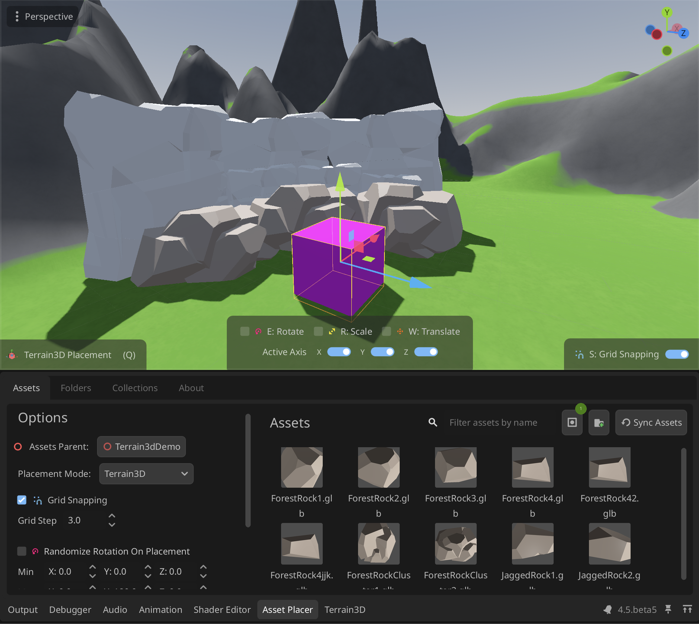

# Godot Asset Placer
This is Godot Editor plugin that allows for quick asset placement and management when working with large 3D Scenes.

> This plugin is still in development and may have bugs or incomplete features. Please report any issues you encounter
> 
> Any Features and Suggestions are welcome as well

# Features
- One-Click Asset Placement with Snapping to Ground and other Collistion shapes
- Organize Assets into collections for quick access and filtering
- Filter Assets by their name and collection

  

# Installation
1. Clone the repository
2. Copy the `addons/asset_placer` folder into your Godot project under the `addons` directory.
3. Enable the plugin in the Godot Editor by going to `Project` -> `Project Settings` -> `Plugins` and enabling the `Asset Placer` plugin.

# Usage
## Adding Assets
Right now the plugin relies on user selecting the folders where your assets are located so that not every scene is added automatically.
You can folders for the plugin sync using "Add folder button" or Folders Tab

After you have added the folders, you can use "Reload" button to sync that folder
> Right now this flow feels a bit clunky, but it is the best I could come up with for now. If you have any suggestions on how to improve it, please let me know.

## Placing Assets
To place an asset, select it from the list and click and navigate to the 3D scene of you choice. If all goes well, you should see a preview of your asset snapping to the neares surface
Click again to place the asset in the scene.

## Organizing Assets
You can organize your assets into collections by selecting the assets and clicking the "Create Collection" button. This will create a new collection with the selected assets. You can also filter assets by their name and collection using the search bar at the top of the plugin window.

Collections is a simple way to "group" assets together by some criteria. For example, you can create a collection for all the trees in your scene, or all the rocks, etc.

## Known Issues
- The plugin currently does not support undo/redo for asset placement. This is a known issue and will be addressed in future updates.
- So far plugin only supports .tscn files, glb and fbx models. If you have any other formats you would like to see supported, please let me know.
- The UI is work in progress..
- No random/custom transform support yet, but it is planned for the future.

[demo.mov](docs/demo.mov)
